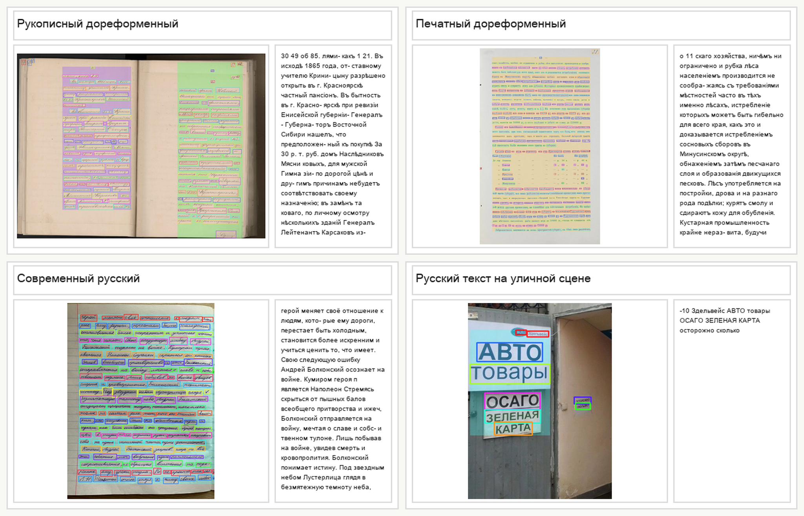

# Manuscript OCR

Manuscript OCR – открытый Python-фреймворк полного OCR/HTR-пайплайна для распознавания дореформенных рукописей на русском языке XVIII–XIX веков и современных текстов. Проект направлен на цифровизацию и анализ исторического текстового наследия с использованием разработанных методов, учитывающих устаревшую орфографию, сложную структуру страниц и вариативность почерков, и обеспечивающих высокую вычислительную эффективность на ограниченных ресурсах.

**[Онлайн-демо](https://huggingface.co/spaces/konstantinkozhin/Manuscript-OCR)** - попробовать Manuscript OCR в браузере  
**[Полная документация](https://konstantinkozhin.github.io/manuscript-ocr)** - English & Русский



---

## Установка

```bash
pip install manuscript-ocr
```

## Минимальный пример

```python
from manuscript import Pipeline

# Инициализация с моделями по умолчанию (CPU)
pipeline = Pipeline()

# Обработка изображения
result = pipeline.predict("document.jpg")

# Извлечение текста
text = pipeline.get_text(result["page"])
print(text)
```

## Дополнительные варианты установки

### Для ускорения на GPU (NVIDIA CUDA)

```bash
# Удалите CPU-версию ONNX Runtime
pip uninstall onnxruntime

# Установите GPU-версию
pip install onnxruntime-gpu
```

### Для Apple Silicon (M1/M2/M3) с CoreML

```bash
# Удалите стандартную версию
pip uninstall onnxruntime

# Установите версию для Apple Silicon
pip install onnxruntime-silicon
```

### Dev-установка с обучением моделей

```bash
pip install manuscript-ocr[dev]
```

### Dev-установка для обучения на GPU (NVIDIA CUDA)

```bash
# Сначала установите manuscript-ocr[dev]
pip install manuscript-ocr[dev]

# Затем обновите PyTorch на GPU версию
pip install --upgrade torch torchvision --index-url https://download.pytorch.org/whl/cu118
```

> **Примечание:** GPU версии (ONNX Runtime GPU и PyTorch CUDA) пользователь устанавливает вручную по необходимости.

---

## Использование GPU/CoreML

```python
from manuscript import Pipeline
from manuscript.detectors import EAST
from manuscript.recognizers import TRBA

# NVIDIA CUDA
detector = EAST(device="cuda")
recognizer = TRBA(device="cuda")
pipeline = Pipeline(detector=detector, recognizer=recognizer)

# Apple Silicon (M1/M2/M3)
detector = EAST(device="coreml")
recognizer = TRBA(device="coreml")
pipeline = Pipeline(detector=detector, recognizer=recognizer)
```

---

## Связанные работы

- Sherstnev, P.A.; Kozhin, K.D.; Pyataeva, A.V. Analyzing the Influence of Hyperparameters on the Efficiency of an OCR Model for Pre-Reform Handwritten Texts. Program Comput Soft 51, 173–180 (2025). https://doi.org/10.1134/S0361768825700069
- Шерстнев, П. А.; Кожин, К. Д.; Пятаева, А. В. Анализ влияния гиперпараметров на эффективность OCR-модели для дореформенных рукописных текстов // Программирование. – 2025. – № 3. – С. 70-79. – DOI 10.31857/S0132347425030071. – EDN GRLAPG.
- Шерстнев, П. А.; Кожин, К. Д.; Пятаева, А. В. Распознавание рукописных текстов отчетов губернаторов Енисейской губернии 19 века // GraphiCon 2024 : Материалы 34-й Международной конференции по компьютерной графике и машинному зрению, Омск, 17–19 сентября 2024 года. – Омск: Омский государственный технический университет, 2024. – С. 519-524. – DOI 10.25206/978-5-8149-3873-2-2024-519-524. – EDN GBEKEZ.

---

> **Проект реализован при поддержке гранта**  
> Фонд содействия инновациям, конкурс «Код-ИИ», VII очередь
