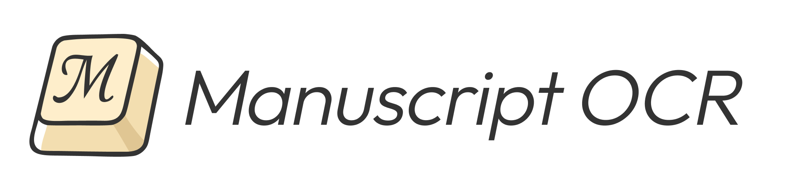

manuscript-ocr Documentation
=============================

**Manuscript OCR** is an open-source Python framework for full OCR/HTR
pipelines targeting pre-reform Russian manuscripts of the 18th-19th
centuries as well as modern texts. The project focuses on digitization and
analysis of historical textual heritage, with methods tailored to legacy
orthography, complex page layouts, handwriting variation, and high
computational efficiency under limited resources.

.. toctree::
   :maxdepth: 2
   :caption: Contents:

   getting_started
   model_zoo
   pipeline_usage
   structure
   api/index
   related_work

Indices and tables
==================

* :ref:`genindex`
* :ref:`modindex`
* :ref:`search`
