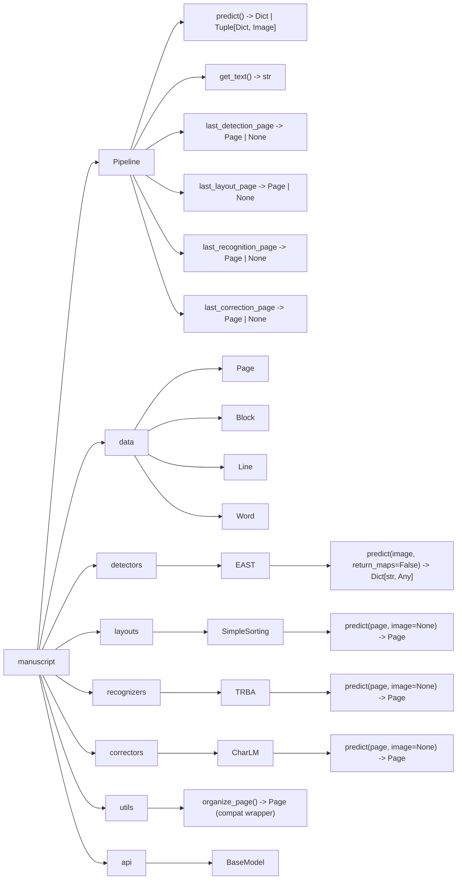

```mermaid
graph LR
    manuscript[manuscript]

    manuscript --> Pipeline["Pipeline"]
    manuscript --> data["data"]
    manuscript --> detectors["detectors"]
    manuscript --> layouts["layouts"]
    manuscript --> recognizers["recognizers"]
    manuscript --> correctors["correctors"]
    manuscript --> utils["utils"]
    manuscript --> api["api"]

    Pipeline --> p_predict["predict() -> Dict | Tuple[Dict, Image]"]
    Pipeline --> p_get_text["get_text() -> str"]
    Pipeline --> p_last_det["last_detection_page -> Page | None"]
    Pipeline --> p_last_layout["last_layout_page -> Page | None"]
    Pipeline --> p_last_rec["last_recognition_page -> Page | None"]
    Pipeline --> p_last_corr["last_correction_page -> Page | None"]

    data --> Page["Page"]
    data --> Block["Block"]
    data --> Line["Line"]
    data --> Word["Word"]

    detectors --> EAST["EAST"]
    EAST --> east_predict["predict(image, return_maps=False) -> Dict[str, Any]"]

    layouts --> SimpleSorting["SimpleSorting"]
    SimpleSorting --> layout_predict["predict(page, image=None) -> Page"]

    recognizers --> TRBA["TRBA"]
    TRBA --> trba_predict["predict(page, image=None) -> Page"]

    correctors --> CharLM["CharLM"]
    CharLM --> charlm_predict["predict(page, image=None) -> Page"]

    utils --> organize_page["organize_page() -> Page (compat wrapper)"]

    api --> BaseModel["BaseModel"]
```
