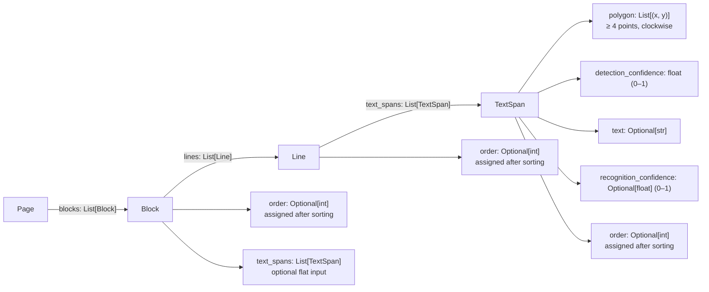

```mermaid
graph LR

    %% Entities
    Page[Page]
    Block[Block]
    Line[Line]
    TextSpan[TextSpan]

    %% Relations
    Page -->|"blocks: List[Block]"| Block
    Block -->|"lines: List[Line]"| Line
    Line -->|"text_spans: List[TextSpan]"| TextSpan

    %% TextSpan fields
    TextSpan --> Tpoly["polygon: List[(x, y)]<br>≥ 4 points, clockwise"]
    TextSpan --> Tdet["detection_confidence: float (0–1)"]
    TextSpan --> Ttext["text: Optional[str]"]
    TextSpan --> Trec["recognition_confidence: Optional[float] (0–1)"]
    TextSpan --> Torder["order: Optional[int]<br>assigned after sorting"]

    %% Line fields
    Line --> LineOrder["order: Optional[int]<br>assigned after sorting"]

    %% Block fields
    Block --> BlockOrder["order: Optional[int]<br>assigned after sorting"]
    Block --> Legacy["text_spans: List[TextSpan]<br>optional flat input"]
```
